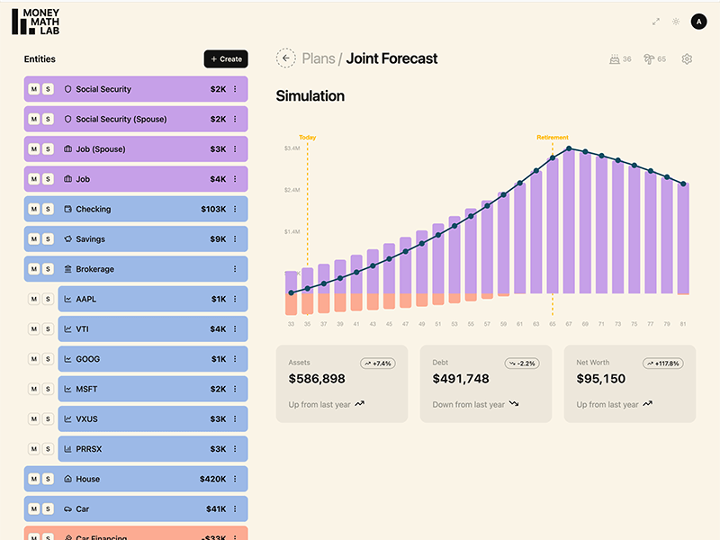

# Money Math Lab

Financial simulation app built with Rails API + Nuxt 4 frontend. Port of the Next.js/Supabase prototype at [moneymathlab.com](https://moneymathlab.com).



## Quick Start

### Prerequisites

- Docker installed ([Get Docker](https://docs.docker.com/get-started/get-docker/))
- VS Code, Cursor, or any IDE with DevContainer support

### Setup

1. Open project in your IDE
2. When prompted, click "Reopen in Container" (or run the DevContainer command)
3. Wait, will take a few minutes (watch output in terminal)...
4. Once container is running, terminal will prompt to press any key to continue
5. Start the front and backend servers using foreman:

```bash
   foreman start -f Procfile.dev
```

6. Open http://localhost:3000

### Using the App

1. Sign up with any email (no verification required)
2. Create a new plan
3. **Recommended:** Use default values for your first plan - just enter a name
4. Explore the plan page and experiment with entities and mute/solo buttons

## Project Structure

Monorepo with Rails backend and Nuxt frontend.

- `backend/`: Database schema, RESTful API, demo data seeding
- `frontend/`: UI, financial simulation engine, entity management

## Development Notes

Alpha-level software. Models are being finalized, features are missing, bugs exist. Entity editing forms currently expose raw data structure.

**Authentication:** Uses simplified session-based auth for demo purposes. Production version at moneymathlab.com uses Supabase Auth.
